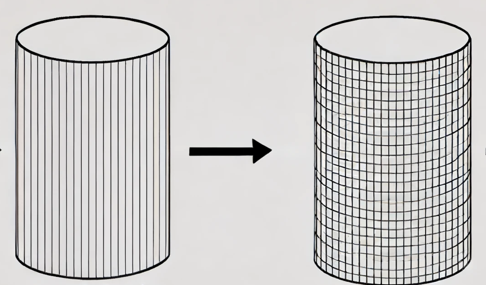
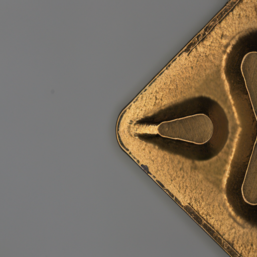
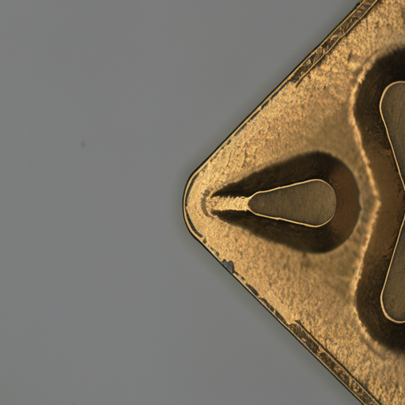
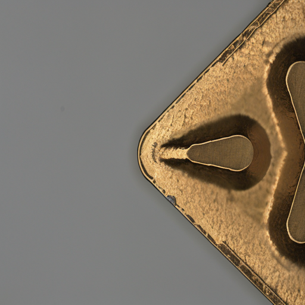
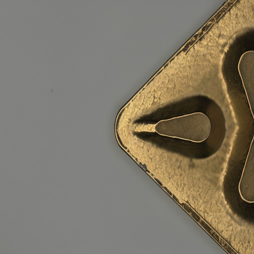

## DISN: Deterministic Synthesis of Defect Images using Null Optimization<br><sub>Official PyTorch Implementation</sub>


This repo contains PyTorch model definitions, pre-trained weights and training/sampling code for our paper exploring Deterministic Synthesis of Defect Images using Null Optimization (DISN) 


This repository contains:

* 🪐 A simple PyTorch [implementation](run.sh) of DISN
* ⚡️ Easy Data Augmentation Using our methodology [implementation](run_dataset.sh) 
* 💥 Our LoRA weight [LoRA](./lora/pytorch_lora_weights.safetensors)

## To Do

- [x] LoRA weight upload 
- [x] Create a Dataset Double 
- [x] Making long options in Various Defect Generation 
- [x] Image size 1024 version
- [x] 😁 Comparison of various defects(new results)


## Setup

First, download and set up the repo:
Code has been tested on Cuda 11.8 but other versions should be fine.

```bash
git clone https://github.com/ugiugi0823/DISN.git
cd DISN
```

We provide an environment.yml file that can be used to create a Conda environment. If you only want to run pre-trained models locally on CPU, you can remove the cudatoolkit and pytorch-cuda requirements from the file.
```bash
conda env create -f environment.yaml
conda activate dune
```


## 1️⃣ If you want to see the demo like the picture below

| Original | Generated |
|:--------:|:---------:|
|  |  |

```bash
bash scripts/run.sh
```
```bash
bash scripts/run_1024.sh
```
It is very similar to the original, but with psnr numbers, you can create a completely different image.
## 2️⃣ What if you actually wanted to double up your existing dataset?



```bash
bash scripts/run_dataset.sh

```
```bash
bash scripts/run_dataset_1024.sh

```
If you want to use your dataset, please modify the --original_dataset_path in run_dataset.sh.
Check results.txt later to check PSNR, SSIM, and LPIPS score.


## 3️⃣ If you want to see various defect like the picture below

| Original | Corrosion | Degradation |
|:--------:|:---------:| :---------:|
| |  |  |
| Original | Peeling | Wear |
| |  |  |

Try changing `--prompt` and `--ch_prompt`
```bash
CUDA_VISIBLE_DEVICES=0 python run_various.py \
--image_path "./img/[0001]TopBF0.png" \
--prompt "photo of a crack defect image" \
--ch_prompt "photo of a crack corrosion image" \
--neg_prompt " " \
```


```bash
bash scripts/run_various.sh
```
```bash
bash scripts/run_various_1024.sh
```

As a result of changing to various prompts, you can see that it changes in a variety of ways compared to the original.


## 4️⃣ Comparison of Various Defects

### Image Size 512

| Defect Type   | PSNR $\uparrow$ | SSIM $\uparrow$ | LPIPS $\downarrow$ |
|---------------|-----------------|-----------------|--------------------|
| original      | 28.79           | 0.879           | 0.046              |
| bilstering    | 21.90           | 0.909           | 0.090              |
| dent          | 27.75           | 0.944           | 0.047              |
| rust          | 27.54           | 0.938           | 0.051              |
| peeling       | 28.16           | 0.941           | 0.042              |
| corrosion     | 29.35           | 0.949           | 0.035              |
| wear          | 30.31           | 0.953           | 0.043              |
| degradation   | **31.68**       | **0.954**       | **0.027**          |

### Image Size 1024

| Defect Type   | PSNR $\uparrow$ | SSIM $\uparrow$ | LPIPS $\downarrow$ |
|---------------|-----------------|-----------------|--------------------|
| original      | 31.05           | 0.892           | 0.088              |
| bilstering    | 24.72           | 0.939           | 0.059              |
| dent          | 28.34           | 0.960           | 0.025              |
| rust          | 28.76           | 0.948           | 0.040              |
| peeling       | 28.29           | 0.950           | 0.038              |
| corrosion     | 31.24           | 0.959           | 0.040              |
| wear          | 28.71           | 0.950           | 0.030              |
| degradation   | **32.12**       | **0.960**       | **0.028**          |


## Acknowledgments
This work was supported by the Institute for Institute of Information \& communications Technology Planning \& Evaluation (IITP) funded by the Ministry of Science and ICT, Government of the Republic of Korea under Project Number RS-2022-00155915. This work was supported by Inha University Research Grant.


<div style="display: flex; justify-content: space-around;">
  
  
  
</div>


## License
The code and model weights are licensed under CC-BY-NC. See [`LICENSE.txt`](LICENSE.txt) for details.