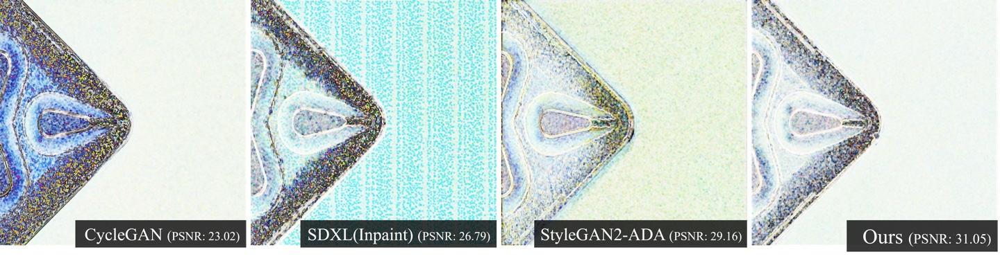
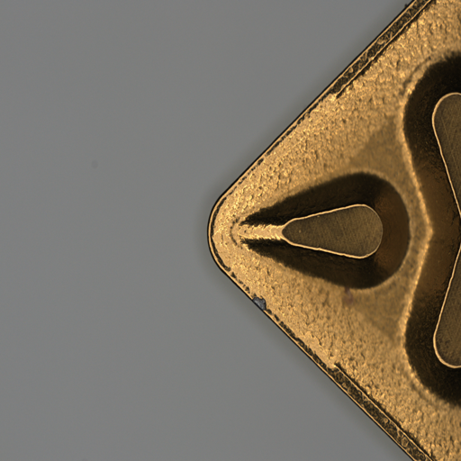
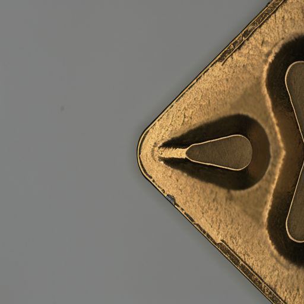
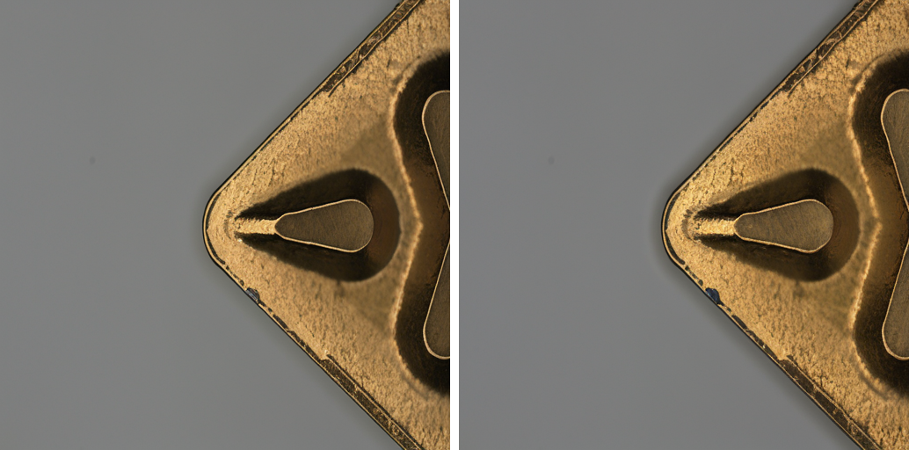

## DISN: Deterministic Synthesis of Defect Images using Null Optimization<br><sub>Official PyTorch Implementation</sub>


This repo contains PyTorch model definitions, pre-trained weights and training/sampling code for our paper exploring Deterministic Synthesis of Defect Images using Null Optimization (DISN) 


This repository contains:

* 🪐 A simple PyTorch [implementation](run.sh) of DISN
* ⚡️ Easy Data Augmentation Using our methodology [implementation](run_dataset.sh) 
* 💥 Our LoRA weight [LoRA](./lora/pytorch_lora_weights.safetensors)

## To Do

- [x] LoRA weight upload 
- [x] Create a Dataset Double 
- [ ] Making long options in Various Defect Generation 

## Setup

First, download and set up the repo:


```bash
git clone https://github.com/ugiugi0823/DISN.git
cd DISN
```

We provide an environment.yml file that can be used to create a Conda environment. If you only want to run pre-trained models locally on CPU, you can remove the cudatoolkit and pytorch-cuda requirements from the file.
```bash
conda env create -f environment.yml
conda activate addib
```


## If you want to see the demo like the picture below
It is very similar to the original, but with psnr numbers, you can create a completely different image.
| Original | Generated |
|:--------:|:---------:|
|  |  |


```bash
bash scripts/run.sh
```

## What if you actually wanted to double up your existing dataset?
If you want to use your dataset, please modify the --original_dataset_path in run_dataset.sh.
```bash
bash scripts/run_dataset.sh
```
Check results.txt later to check PSNR, SSIM, and LPIPS score.


## If you want to see various defect like the picture below [Not Yet]
Results of changing text to defect > correlation using existing prompts

```
prompts = ["photo of a crack defect image",
            "photo of a crack corrosion image"]
```

| Original | Corrosion |
|:--------:|:---------:|
|  |


It can be confirmed that the defect is corroded compared to the original.
```bash
bash scripts/run_various.sh
```


## Acknowledgments
This work was supported by the Institute for Institute of Information \& communications Technology Planning \& Evaluation (IITP) funded by the Ministry of Science and ICT, Government of the Republic of Korea under Project Number RS-2022-00155915. This work was supported by Inha University Research Grant.


## License
The code and model weights are licensed under CC-BY-NC. See [`LICENSE.txt`](LICENSE.txt) for details.