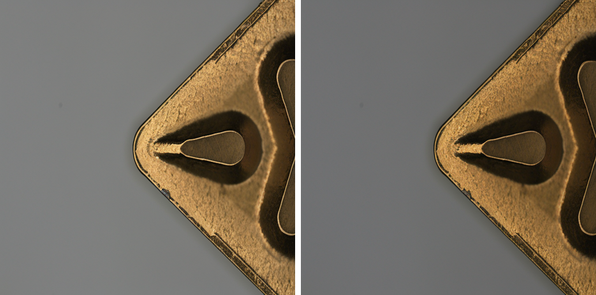

## DISN: Deterministic Synthesis of Defect Images using Null Optimization<br><sub>Official PyTorch Implementation</sub>


This repo contains PyTorch model definitions, pre-trained weights and training/sampling code for our paper exploring Deterministic Synthesis of Defect Images using Null Optimization (DISN) 


This repository contains:

* 🪐 A simple PyTorch [implementation](run.sh) of DISN
* ⚡️ Easy Data Augmentation Using our methodology [implementation](run_dataset.sh) 
* 💥 [Colab notebook](http://colab.research.google.com/github/facebookresearch/DiT/blob/main/run_DiT.ipynb) for running DISN


## Setup

First, download and set up the repo:


```bash
git clone https://github.com/ugiugi0823/DISN.git
cd DISN
```

We provide an environment.yml file that can be used to create a Conda environment. If you only want to run pre-trained models locally on CPU, you can remove the cudatoolkit and pytorch-cuda requirements from the file.
```bash
conda env create -f environment.yml
conda activate addib
```


## If you want to see the demo like the picture below

```bash
bash run.sh
```


## What if you actually wanted to double up your existing dataset?

```bash
bash run_dataset.sh
```


## Acknowledgments
This work was supported by the Institute for Institute of Information \& communications Technology Planning \& Evaluation (IITP) funded by the Ministry of Science and ICT, Government of the Republic of Korea under Project Number RS-2022-00155915. This work was supported by Inha University Research Grant.


## License
The code and model weights are licensed under CC-BY-NC. See [`LICENSE.txt`](LICENSE.txt) for details.